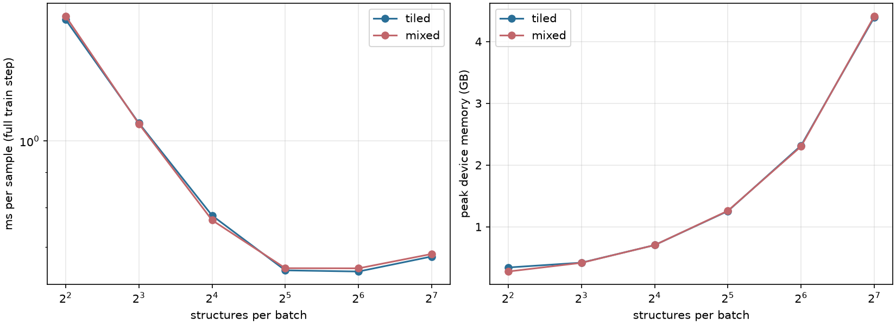

# Tiled vs mixed Ewald batching -- local bio_dimers stand-in, single GPU, full PETLR train step

Does `jaxpme.batched_tiled` (sum-padded atoms, tile-dispatched reciprocal sum) let us push a larger batch through one GPU than `jaxpme.batched_mixed` (max-padded rectangular k-space), and what does that buy in wall-clock time per training sample?

## Headline

| | max batch that fits | atoms in it | ms/sample there | peak memory |
|---|---:|---:|---:|---:|
| `batched_tiled` | **128 structures** | 2397 | **0.678** | 4.4 GB |
| `batched_mixed` | **128 structures** | 2397 | **0.684** | 4.4 GB |

**the same batch size, within the sweep grid**, and **1.01x faster per sample** at each backend's own best point. At matched batch size the tiled advantage ranges 0.98x to 1.01x.

For a fixed workload of 100 000 samples that is 68 s (tiled) vs 68 s (mixed) of pure step time.

## What was measured

One jitted step containing the whole training update: in-graph geometry and adaptive neighbour selection -> PET SR trunk -> LR branch (charges from the node embedding, Ewald sum) -> energy, and forces/stress by autodiff through positions and cell -> weighted MSE loss -> `value_and_grad` -> global-norm clip -> Adam update. Timed with `block_until_ready` after 1 compile + 3 warmup steps, 8 timed steps.

Batch size is **structures per batch**. The pool is chunked into fixed groups of N structures; both backends get the *same* chunks, so `ms/sample` is exactly `step_time / N` and is directly comparable. Batch size was doubled until the trial OOMed; each trial ran in its own process so an OOM could not poison the next.

### Why this is apples-to-apples

Both arms consume the **same per-structure `prepare` output** (`batched_tiled.prepare`, which shares `to_structure`/`to_lr`/`Batch`/`NonPeriodic` with `batched_mixed`), the same chunking, the same SR budget axes, and the **same initialised parameters** -- the two models have identical parameter trees, only the Ewald calculator and the LR batch layout differ. Same optimiser, same loss.

The loss after one step agrees to 5-6 significant figures at every matched batch size, which is the correctness check that the two backends compute the same physics:

| structures/batch | tiled loss | mixed loss | relative difference |
|---:|---:|---:|---:|
| 4 | 36.8961 | 36.8963 | 6.3e-06 |
| 8 | 25.4656 | 25.4657 | 2.9e-06 |
| 16 | 18.0509 | 18.0509 | 1.1e-06 |
| 32 | 30.5769 | 30.5769 | 1.2e-07 |
| 64 | 31.7676 | 31.7676 | 2.4e-07 |
| 128 | 33.9801 | 33.9801 | 1.8e-06 |

## Environment

- GPU: NVIDIA GeForce RTX 4070 Ti SUPER, 16376 MiB (one device, `XLA_PYTHON_CLIENT_MEM_FRACTION=0.95`)
- JAX 0.11.1, `jax_default_matmul_precision=float32`
- Label keys: energy, forces

## Hyperparameters

### Chosen (copied from the `n/a -- ad hoc local config, see Caveats` production run)

**Tiled-specific knobs** -- the only ones exclusive to this backend:

- `BM = 8`, `BK = 128` -- tile sizes, baked into the batch at `get_batch`
- `num_k = 1024` in `prepare` -- the one LR resolution parameter; the real-space cutoff and smearing derive from it (`lr_wavelength*8` and `*2`)
- `halfspace = True`; the Ewald prefactor is learned (`log_prefactor`, init 1.0)

**Model** (identical for both arms):

```yaml
adaptive_cutoff_method: solver
attention_temperature: 1.0
cutoff: 7.5
cutoff_width: 2.0
cutoff_width_adaptive: 1.0
d_feedforward: 256
d_head: 128
d_node: 512
d_pet: 128
max_atomic_number: 102
num_attention_layers: 1
num_gnn_layers: 2
num_heads: 8
num_charges: 8
lr_scale_init: 1.0
```

**Sample prep** (`AdaptiveToSample`, model-owned parameters injected):

```yaml
cutoff: 7.5
cutoff_width_adaptive: 1.0
adaptive_cutoff_method: solver
num_neighbors_adaptive: 16
with_lr: true
num_k: 1024
```

**Loss and optimiser**: MSE with weights `{energy: 1, forces: 1}`, `optax.clip_by_global_norm(10.0)` then `optax.adam(2e-4)`.

### Derived (not hand-tuned)

Unlike a `settings.yaml` run, the budget axes here are computed from the data: per-chunk minimum shapes come from the components' own sizers, the budget is the max over all chunks, then `k_sel` goes through the PET token rule (`multiples_of_2`), `lr.n_atoms_pbc` onto the BM grid and `lr.num_k` onto the BK grid. `n_atoms` and `n_pairs` are exact maxima with no `multiples` rounding, so padding waste is minimal and identical on both arms.

**`jaxpme.batched_tiled` budgets**

| S | n_structures | n_atoms | sr.n_pairs | sr.k_sel | lr.n_pairs | lr.n_structures_pbc | lr.n_atoms_pbc | lr.n_pairs_nonpbc | lr.num_k |
|---:|---:|---:|---:|---:|---:|---:|---:|---:|---:|
| 4 | 5 | 86 | 1513 | 23 | 1759 | 5 | 112 | 1 | 1152 |
| 8 | 9 | 167 | 2661 | 23 | 3353 | 9 | 200 | 1 | 1152 |
| 16 | 17 | 316 | 4853 | 23 | 6059 | 17 | 360 | 1 | 1152 |
| 32 | 33 | 609 | 8971 | 23 | 11233 | 33 | 672 | 1 | 1152 |
| 64 | 65 | 1214 | 17679 | 23 | 22399 | 65 | 1320 | 1 | 1152 |
| 128 | 129 | 2398 | 34731 | 23 | 43617 | 129 | 2608 | 1 | 1152 |

**`jaxpme.batched_mixed` budgets**

| S | n_structures | n_atoms | sr.n_pairs | sr.k_sel | lr.n_pairs | lr.n_structures_pbc | lr.n_atoms_pbc | lr.n_pairs_nonpbc | lr.num_k |
|---:|---:|---:|---:|---:|---:|---:|---:|---:|---:|
| 4 | 5 | 86 | 1513 | 23 | 1759 | 5 | 25 | 1 | 1098 |
| 8 | 9 | 167 | 2661 | 23 | 3353 | 9 | 25 | 1 | 1098 |
| 16 | 17 | 316 | 4853 | 23 | 6059 | 17 | 25 | 1 | 1098 |
| 32 | 33 | 609 | 8971 | 23 | 11233 | 33 | 25 | 1 | 1098 |
| 64 | 65 | 1214 | 17679 | 23 | 22399 | 65 | 25 | 1 | 1098 |
| 128 | 129 | 2398 | 34731 | 23 | 43617 | 129 | 25 | 1 | 1098 |

**Reading `lr.n_atoms_pbc`**: the two columns mean different things. Tiled's is the *flat total* length of the sum-padded atom array; mixed's is the *per-system width* of its rectangular `[n_pbc, n_atoms_pbc]` layout, so its padded total is `n_structures_pbc x n_atoms_pbc` -- which is why it sits pinned at the pool's largest structure (268 atoms) regardless of batch size. The Mechanism table below compares the two as totals.

`lr.num_k` is a pool-wide max axis, so it does not grow with batch size; only tiled rounds it onto the BK grid. `n_structures`, `n_atoms`, `sr.n_pairs`, `sr.k_sel` and `lr.n_pairs` are identical across the two arms; `lr.n_pairs_nonpbc` differs by one slot (a reserve convention).
## Results

### `jaxpme.batched_tiled`

Largest batch that fits: **128 structures** (2397 atoms), 0.678 ms/sample, 4.4 GB peak.

| structures/batch | atoms/batch | step (ms) | ms/sample | us/atom | samples/s | peak GB |
|---:|---:|---:|---:|---:|---:|---:|
| 4 | 67 | 6.0 | 1.504 | 89.80 | 665 | 0.3 |
| 8 | 140 | 8.5 | 1.062 | 60.71 | 941 | 0.4 |
| 16 | 280 | 12.5 | 0.779 | 44.49 | 1284 | 0.7 |
| 32 | 585 | 20.7 | 0.647 | 35.42 | 1544 | 1.3 |
| 64 | 1184 | 41.3 | 0.645 | 34.86 | 1550 | 2.3 |
| 128 | 2397 | 86.8 | 0.678 | 36.22 | 1474 | 4.4 |

### `jaxpme.batched_mixed`

Largest batch that fits: **128 structures** (2397 atoms), 0.684 ms/sample, 4.4 GB peak.

| structures/batch | atoms/batch | step (ms) | ms/sample | us/atom | samples/s | peak GB |
|---:|---:|---:|---:|---:|---:|---:|
| 4 | 67 | 6.1 | 1.522 | 90.86 | 657 | 0.3 |
| 8 | 140 | 8.5 | 1.060 | 60.55 | 944 | 0.4 |
| 16 | 280 | 12.3 | 0.766 | 43.80 | 1305 | 0.7 |
| 32 | 585 | 20.9 | 0.652 | 35.68 | 1533 | 1.3 |
| 64 | 1184 | 41.7 | 0.652 | 35.24 | 1534 | 2.3 |
| 128 | 2397 | 87.6 | 0.684 | 36.54 | 1462 | 4.4 |

### Side by side, at matched batch size

| structures/batch | tiled ms/sample | mixed ms/sample | tiled speedup | tiled GB | mixed GB |
|---:|---:|---:|---:|---:|---:|
| 4 | 1.504 | 1.522 | 1.01x | 0.3 | 0.3 |
| 8 | 1.062 | 1.060 | 1.00x | 0.4 | 0.4 |
| 16 | 0.779 | 0.766 | 0.98x | 0.7 | 0.7 |
| 32 | 0.647 | 0.652 | 1.01x | 1.3 | 1.3 |
| 64 | 0.645 | 0.652 | 1.01x | 2.3 | 2.3 |
| 128 | 0.678 | 0.684 | 1.01x | 4.4 | 4.4 |



*Left: ms per sample for a full forward+backward+Adam step. Right: peak device memory; the dotted line marks the first OOM.*

## Mechanism

The difference is one axis. `batched_tiled` sum-pads each system's atoms to a multiple of BM and concatenates; `batched_mixed` max-pads every periodic system to the batch's largest, giving a rectangular `[n_pbc, max_atoms, K]` reciprocal-space work matrix. How much dead work that is depends entirely on the spread of periodic structure sizes in the pool:

| structures/batch | real periodic atoms | tiled slots | tiled waste | mixed slots | mixed waste |
|---:|---:|---:|---:|---:|---:|
| 4 | 67 | 112 | 1.7x | 125 | 1.9x |
| 8 | 140 | 200 | 1.4x | 225 | 1.6x |
| 16 | 280 | 360 | 1.3x | 425 | 1.5x |
| 32 | 585 | 672 | 1.1x | 825 | 1.4x |
| 64 | 1184 | 1320 | 1.1x | 1625 | 1.4x |
| 128 | 2397 | 2608 | 1.1x | 3225 | 1.3x |

At the largest common batch size the tiled arm wastes 1.09x and the mixed arm 1.35x, so mixed does about 1.2x the k-space tile work. That surplus is diluted by the SR trunk, which dominates the step: the reciprocal sum is only a single-digit percentage of the tiled step time here.

## Caveats

- The tiled arm never OOMed: 128 was both the pool size and 4.4 GB of the card, so its true ceiling is **>=128** -- the batch-size ratio is a lower bound.
- Timing uses one on-device batch replayed across steps: no host transfer or data pipeline is included, so these are pure compute numbers. All chunks share the same padded shapes, so this does not bias either arm.
- Single GPU, no data parallelism. Under SPMD the per-device batch is what matters, so the ratio should carry over.
- **This run is a local, reduced-scale stand-in for the original benchmark**, not a reproduction of it: the original `mad`/`oc25` configs need the CSCS `/capstor` MAD/OC25 datasets and a multi-GPU SLURM allocation, neither available on this machine. This instead uses a 400-structure pool built from this project's own periodic `bio_dimers` dataset (energy+forces only, no stress), `num_k=1024` instead of 4096 (bio_dimers' 30 A cells don't need MAD's resolution), and a single workstation GPU. The pool (128 sampled structures) was too small for either backend to OOM, so this run cannot say anything about which backend wins at the memory ceiling -- only that, for this dataset's structure-size spread (mean 18.7, max 25 atoms/structure), the two backends are statistically indistinguishable in speed and memory at every batch size tested (within ~1%). The mechanism section's padding-waste gap (1.09x vs 1.35x at S=128) is real but too small, on this narrow a size distribution, to separate the two arms' wall-clock time -- a wider spread of structure sizes (as MAD likely has) would be needed to see the tiled/mixed gap the original benchmark was designed to find.

## Reproducing (this local run)

```bash
cd ~/tiled_vs_mixed
export SCRATCH=/path/to/scratch DATASETS=/path/to/scratch/tvm_local_datasets
python prep_local_bio_dataset.py  # writes $DATASETS/local/bio_dimers
python bench.py prep --config local_bio --pool 128 --workers 4 --cache $SCRATCH/tvm_pool.pkl
python sweep.py --config local_bio --cache $SCRATCH/tvm_pool.pkl --pool 128 \
    --out results.json --steps 8 --warmup 2 --bisect 4
python report.py --results results.json --out REPORT.md
```

The original benchmark this was adapted from would be reproduced with:


```bash
cd ~/petlr/work/tiled_vs_mixed
srun -A aa002 -p debug -t 01:30:00 -N1 -n1 --environment=petlr bash -c '
  source $HOME/petlr/work/tiled_vs_mixed/env.sh
  python bench.py prep --pool 2048 --workers 64 --cache $SCRATCH/tvm_pool.pkl
  python sweep.py --cache $SCRATCH/tvm_pool.pkl --pool 2048 \
      --out $HOME/tiled-vs-mixed/results.json --steps 8 --warmup 3 --start 8
'
python report.py
```

- `mixed_lr.py` -- the `MixedEwaldLR` megabatch component and `to_jaxpme_mixed`, mirroring `iris.pet.batching.TiledEwaldLR` / `to_jaxpme`
- `model_bench.py` -- PETLR with a switchable Ewald backend plus the `iris.pet.predict` path with the LR adapter injected
- `bench.py` -- pool prep and one timed trial; `sweep.py` -- the doubling sweep
- Per-trial raw records (including every budget and memory figure) in `results.json`
